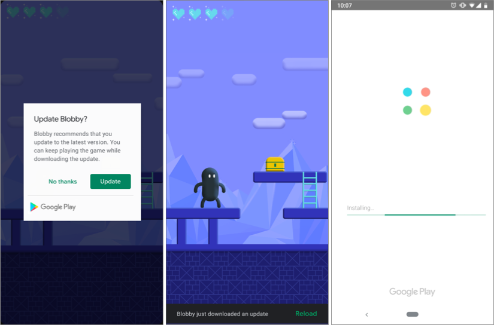

[](http://www.apache.org/licenses/LICENSE-2.0.html)
[](https://jitpack.io/#EdgeJH/InAppUpdate)

# Android InAppUpdate

안드로이드 어플리케이션의 버전 관리를 위하여 구글에서 제공하는 In-App-Support를 좀 더 사용하기 쉽도록 만든 라이브러리 입니다.

#### Flexible Update


#### Immediate Update


## Description

- Kotlin 과 Java 모두 사용 가능하며 기존 Java의 편의성을 위해 Builder Pattern 을 적용하였습니다. 

- UpdateManager 에서 checkUpdate() 메소드를 실행시에 현재 구글플레이의 버전과 상태들을 열람합니다. 그 내용은 AppUpdateInfo에 담겨 있으며 해당 정보에 따라 업데이트 전략을 세워 진행하시면 되겠습니다.

- updateAvailable 파라미터는 현재 바로 업데이트가 진행 가능한지 여부가 담겨있습니다.

- Flexible 타입의 경우 update() 메소드 실행시 Dialog 형태로 업데이트가 진행되고 진행이 완료된 이후에는 시간제한 없는 스낵바와 스낵바의 액션을 통해 재시작이 가능합니다.

- Immediate 타입의 경우 구글 플레이 화면으로 이동후 업데이트 진행한뒤 다시 액티비티에 돌아오면 onActivityResult() 메소드를 통하여 업데이트 상태를 트래킹 할 수 있습니다.


## Download

``` gradle
allprojects {
	repositories {
		...
		maven { url 'https://jitpack.io' }
	}
}
  
dependencies {
	implementation 'com.google.android.play:core:1.7.2'
	implementation 'com.github.EdgeJH:InAppUpdate:(insert latest version)'
}

```


## Usage

#### Inherit Custom Update

``` kotlin

class InheritInAppUpdateActivity : InAppUpdateActivity() {

    override fun onCreate(savedInstanceState: Bundle?) {
        super.onCreate(savedInstanceState)
        setContentView(R.layout.activity_inherit_in_app_update)
        initView()
        checkUpdate(this)
    }

    override fun onUpdateAvailable(appUpdateInfo: AppUpdateInfo, updateAvailable: Boolean) {
        if (updateAvailable){
            startUpdate(appUpdateInfo)
        }
    }

    override fun onInstallState(installState: InstallState, bytesDownLoaded: Long, totalBytesToDownLoaded: Long) {
        when(installState.installStatus()){
            InstallStatus.DOWNLOADING->{
               //in app update downloading progess
            }
            InstallStatus.DOWNLOADED->{
                restart()
            }
        }
    }

    override fun onUpdateFailure(exception: Exception?) {
        Toast.makeText(this,"Update Failure ${exception.message}", Toast.LENGTH_SHORT).show()
    }

}
```


#### Flexible Update

``` java

    @Override
    protected void onCreate(Bundle savedInstanceState) {
        super.onCreate(savedInstanceState);
        setContentView(R.layout.activity_flexible);
        UpdateManager.Builder builder = new UpdateManager.Builder()
                        .setActivity(this)
                        .setUpdateType(UpdateType.FLEXIBLE);
        final UpdateManager updateManager = builder.create();
        updateManager.setUpdateListener(new UpdateListener() {
            @Override
            public void onUpdateChecked(@NotNull AppUpdateInfo appUpdateInfo, boolean updateAvailable) {
                if (updateAvailable){
                    updateManager.update(appUpdateInfo);
                }

            }
            @Override
            public void onUpdateCheckFailure(@Nullable Exception exception) {
                if (exception!=null){
                    Toast.makeText(FlexibleUpdateActivity.this, "error : " +  exception.getMessage(), Toast.LENGTH_SHORT).show();
                }
            }
            @Override
            public void onUpdateState(@NotNull InstallState installState, long bytesDownLoaded, long totalBytesToDownLoaded) {
                if (installState.installStatus()== InstallStatus.DOWNLOADED){
                    updateManager.showSnackBarForCompleteUpdate("업데이트가 완료 되었습니다",ContextCompat.getColor(FlexibleUpdateActivity.this,R.color.colorAccent));
                }
            }
        });
        updateManager.checkUpdate();
    }

```


#### Immediate Update


``` java
    @Override
    protected void onCreate(Bundle savedInstanceState) {
        super.onCreate(savedInstanceState);
        setContentView(R.layout.activity_immediate_update);
        UpdateManager.Builder builder = new UpdateManager.Builder()
                        .setActivity(this)
                        .setUpdateType(UpdateType.IMMEDIATE);
        final UpdateManager updateManager = builder.create();
        updateManager.setUpdateListener(new UpdateListener() {
            @Override
            public void onUpdateChecked(@NotNull AppUpdateInfo appUpdateInfo, boolean updateAvailable) {
                if (updateAvailable){
                    updateManager.update(appUpdateInfo);
                }
            }

            @Override
            public void onUpdateCheckFailure(@Nullable Exception exception) {
                if (exception != null) {
                    Toast.makeText(ImmediateUpdateActivity.this, "error : " + exception.getMessage(), Toast.LENGTH_SHORT).show();
                }
            }

            @Override
            public void onUpdateState(@NotNull InstallState installState, long bytesDownLoaded, long totalBytesToDownLoaded) {

            }
        });
        updateManager.checkUpdate();
    }

    @Override
    protected void onActivityResult(int requestCode, int resultCode, Intent data) {
        super.onActivityResult(requestCode, resultCode, data);
        if (requestCode == UpdateManager.UPDATE_REQ_CODE) {
            switch (resultCode) {
                case RESULT_OK:
                    //업데이트 완료
                    break;
                case RESULT_CANCELED:
                    //업데이트 취소
                    break;
                default:
                    //업데이트 실패
                    break;
            }
        }
    }

```


